<h1 align="center">Hi, I'm Nermine Dridi 🐢</h1>

<p align="center">
  <a href="https://github.com/nerminedridi">
    
  </a>
</p>

<p align="center">
  <a href="https://nerminedridi.vercel.app/"></a>
  <a href="https://www.linkedin.com/in/nermine-dridi"></a>
  <a href="mailto:nermine.dridi1311@gmail.com"></a>
</p>

<p align="center">
  
</p>

---

## 🙋‍♀️ About me

I'm a Computer Science student at **Università del Piemonte Orientale** (Vercelli, Italy) who builds working products, from full-stack web apps to small hardware gadgets, always designed with the end user in mind.

```js
const nermine = {
  studying:   "B.Sc. Computer Science @ Università del Piemonte Orientale",
  role:       "Full-Stack Developer",
  building:   ["Cyberdeck 🎙️", "Faultline 🤖"],
  favStack:   ["Node.js", "Express", "PostgreSQL", "TypeScript", "Python"],
  speaks:     ["Arabic", "French", "English", "Italian"],
  lookingFor: "A software development internship from Feb/Mar 💼",
};
```

---

## 🧰 Tech stack

<h4 align="center">💬 Languages</h4>
<div align="center">
<table>
  <tr>
    <td align="center" width="90"><br><sub><b>Java</b></sub></td>
    <td align="center" width="90"><br><sub><b>Python</b></sub></td>
    <td align="center" width="90"><br><sub><b>C</b></sub></td>
    <td align="center" width="90"><br><sub><b>JavaScript</b></sub></td>
    <td align="center" width="90"><br><sub><b>TypeScript</b></sub></td>
    <td align="center" width="90"><br><sub><b>HTML</b></sub></td>
    <td align="center" width="90"><br><sub><b>CSS</b></sub></td>
  </tr>
</table>
</div>

<h4 align="center">⚙️ Backend & Databases</h4>
<div align="center">
<table>
  <tr>
    <td align="center" width="90"><br><sub><b>Node.js</b></sub></td>
    <td align="center" width="90"><br><sub><b>Express</b></sub></td>
    <td align="center" width="90"><br><sub><b>PostgreSQL</b></sub></td>
    <td align="center" width="90"><br><sub><b>Auth</b></sub></td>
    <td align="center" width="90"><br><sub><b>Charts</b></sub></td>
    <td align="center" width="90"><br><sub><b>Media</b></sub></td>
  </tr>
</table>
</div>

<h4 align="center">🛠️ Tools & Hardware</h4>
<div align="center">
<table>
  <tr>
    <td align="center" width="90"><br><sub><b>Git</b></sub></td>
    <td align="center" width="90"><br><sub><b>GitHub</b></sub></td>
    <td align="center" width="90"><br><sub><b>VS Code</b></sub></td>
    <td align="center" width="90"><br><sub><b>Vercel</b></sub></td>
    <td align="center" width="90"><br><sub><b>Testing</b></sub></td>
    <td align="center" width="90"><br><sub><b>Raspberry Pi</b></sub></td>
  </tr>
</table>
</div>

---

## 🚀 Featured projects

<div align="center">
<table>
  <tr>
    <td align="center">
      <a href="https://github.com/nerminedridi/Artelio"></a><br>
      <sub><a href="https://github.com/nerminedridi/Artelio">📂 Repository</a></sub>
    </td>
    <td align="center">
      <a href="https://study-tracker-flow-nmn.vercel.app"></a><br>
      <sub><a href="https://github.com/nerminedridi/study-tracker">📂 Repository</a> · <a href="https://study-tracker-flow-nmn.vercel.app">🌐 Live demo</a></sub>
    </td>
  </tr>
  <tr>
    <td align="center">
      <br>
      <sub>🔧 Coming soon</sub>
    </td>
    <td align="center">
      <a href="https://github.com/nerminedridi/Faultline"></a><br>
      <sub><a href="https://github.com/nerminedridi/Faultline">📂 Repository</a></sub>
    </td>
  </tr>
</table>
</div>

---

## 📊 GitHub analytics

<div align="center">
  
  
  <br><br>
  
</div>

---

## 🤝 Let's connect

<p align="center">
  Always happy to talk about web development, projects or internship opportunities. Feel free to reach out!
</p>

<p align="center">
  <a href="https://www.linkedin.com/in/nermine-dridi"></a>
  <a href="mailto:nermine.dridi1311@gmail.com"></a>
  <a href="https://nerminedridi.vercel.app/"></a>
</p>


